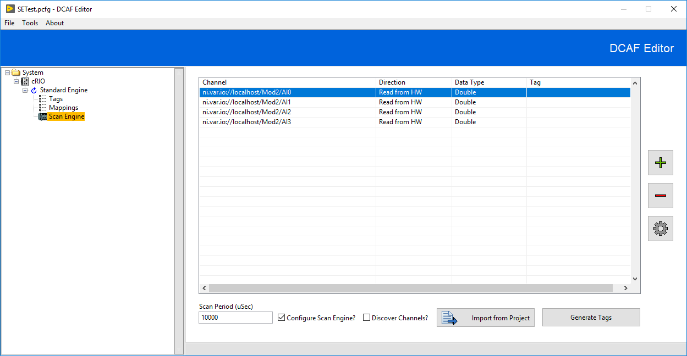

# Overview

The Scan engine module makes interfacing with Shared Variables and the Scan Engine easy. It should be the default choice for interacting with C Series modules in DCAF.

# Description

The Scan Engine is the preferred method for communicating with C Series modules in a CompactRIO for DCAF. However, Scan Engine cannot meet the needs of all applications for all kinds of I/O. See the section on Scan Engine in the [cRIO Developer's Guide](http://www.ni.com/pdf/products/us/fullcriodevguide.pdf) for more information on its limitations.

The Scan Engine Module can also be used to connect to data published with Shared Variables. To learn more about Shared Variables, see the following [LabVIEW help document](http://zone.ni.com/reference/en-XX/help/371361G-01/lvconcepts/usingdynvarapi/).

# Configuration of the Scan Engine Module

The Scan Engine module works best if you configured your project to set up your CompactRIO with the C Series modules you will use in your application. Once you have configured your project, open the DCAF Editor and add the Scan Engine Module to your DCAF Engine.

**Import from Project**: This button will prompt the user to open a project and will automatically load all IO Variables it can find in the project (this includes all shared variables within the project). 

**Generate Tags**: Automatically creates tags and map tags to existing channels. If you remove a module from your project, the *Import from Project* button will not automatically remove the channels created earlier. You must manually remove those channels.

**Scan Period**: Lets user configure the execution period of Scan Engine. To Synchronize the DCAF engine with this period, select the *Synchronize to Scan Engine* or *Use Module Timing Source* options in the engine configuration.

**Discover Channels**: Selecting this checkbox will automatically create I/O channels for additional C-Series  I/O that is discovered at run time. This is useful for some modules such as the TDMS module that can automatically log tags that it discovers.

You can also manually add IO Variables using the *+* button, delete channels using the *-* button, and use the gear button to edit a channel. When adding or editing a channel, the screen below will be presented:

**Access Type:** Whether the data will be coming into the DCAF module from Scan Engine (Read from HW) or out to Scan Engine from DCAF (Write to HW).

**Protocol:** Whether to use the Scan Engine IO Variable protocol (ni.var.io) or the NI Publish-Subscribe Protocol (ni.var.psp) for network published shared variables.

**Hostname:** The name of the host publishing the variable. For C Series Modules on the same CompactRIO that will be running DCAF, you can use localhost.

**Variable Name:** The name of the shared variable or IO variable on the host.

**Data Type:** The data type of the variable.

**Tag:** The Tag you want to connect the channel to.

# Limitations

As with any application using the Scan Engine for I/O, systems with large channel counts can have their CPU usage dominated by Scan Engine. See the cRIO developer's guide mentioned earlier for some more background.

### Software Requirements

+   LabVIEW 2014 or later

### Hardware Requirements

+   Not every C Series module supports Scan Engine. See the manual for the modules you want to use to see if it is supported.
